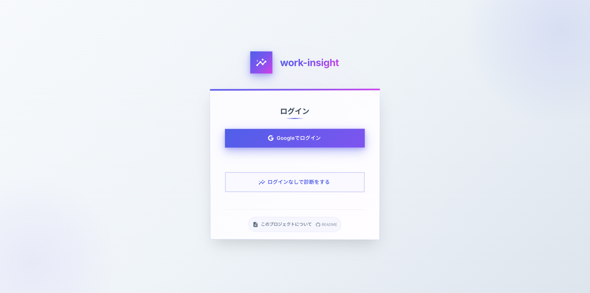

# Work Insight

**仕事上の行動・判断の傾向を4軸スコアで可視化する自己理解支援 Web アプリ**

> 性格診断ではなく「仕事の進め方の傾向」を数値化するツールです。良し悪しの評価は行いません。

**[デモを試す（ログイン不要）](https://personal-insight-2d2fe.web.app/app/)**

---

## スクリーンショット

| ログイン | ダッシュボード |
|---|---|
|  |  |

---

## 技術スタック

| カテゴリ | 技術 |
|---|---|
| フロントエンド | Next.js 14 (React 18) / TypeScript |
| UI | Material-UI (MUI) / Recharts |
| 認証 | Firebase Authentication (Gmail) |
| DB | Cloud Firestore |
| ホスティング | Firebase Hosting (静的エクスポート) |
| PDF出力 | html2canvas + jsPDF |
| テスト | Jest + React Testing Library |

---

## 主な機能

| 機能 | 説明 |
|---|---|
| ログイン不要の診断 | ゲストとして診断を試せる（結果はローカル保存） |
| 4軸スコア算出 | 12問のスライダー回答を加重平均でスコア化 |
| 結果の可視化 | レーダーチャート・棒グラフ・立ち位置説明文 |
| 診断履歴 | 過去の結果を時系列チャートで振り返り |
| PDF出力 | 診断結果を1クリックでPDF保存 |

### 4軸スコアについて

各軸は 0〜100（50 = どちらでもない）で表現します。

| 軸 | 低スコア | 高スコア |
|---|---|---|
| 行動エネルギー | よく考えてから動く | まず動く |
| 判断基準 | 人の気持ち重視 | 論理・事実重視 |
| 進め方 | 柔軟に変えたい | 計画通りに進めたい |
| 視点 | 現実・具体 | 抽象・将来 |

---

## アーキテクチャ

```
pages/          ← ルーティングのみ
containers/     ← ページロジック（hooks を束ねて Presentation へ渡す）
presentation/   ← 純粋な UI レンダリング（props のみで動作）
hooks/          ← Firestore データ取得・状態管理
utils/          ← スコア算出・コメント生成・PDF出力
lib/            ← Firebase 初期化・Firestore ヘルパー
```

Containers / Presentation の分離により、ロジックと UI を独立してテスト・変更できます。

### Firestore データ構造

```
users/{uid}/
  axis_scores/latest          # 最新スコア
  assessment_history/{id}     # 診断履歴（answeredAt 降順）
```

Firestore Rules により、本人データのみアクセス可能です。

---

## こだわった点

### ゲストモード
アカウント登録なしでも診断を試せるよう、ゲストユーザーの結果を `localStorage` に一時保存する設計にしました。ログイン後に履歴として永続化する導線も設けています。

### 層構造による関心の分離
`Container → Presentation` パターンを採用し、Firestore の依存を hooks 層に閉じ込めました。Presentation コンポーネントは props のみで動作するため、テストが容易です。

### セキュリティ
Firestore Rules でユーザーごとのデータ分離を実装。未認証ユーザーは `ProtectedRoute` によってログイン画面へリダイレクトされます。

---

## ローカル開発

```bash
npm install
# .env.local に Firebase 設定を記載（.env.local.example を参照）
npm run dev
```

```bash
npm test              # ユニットテスト
npm run test:coverage # カバレッジ付き
npm run deploy        # Firebase へデプロイ（要 firebase-tools ログイン）
```
