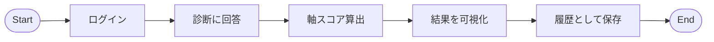
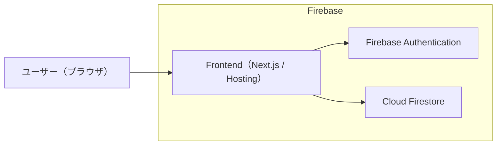

# Work Insight 要件定義書

---

---

## 1. プロジェクト概要

### 1.1 プロジェクトの目的

Work Insight は、仕事上の行動・判断の傾向を数値で可視化することで、  
以下を実現する自己理解支援ツールである。

- 自分自身の仕事の進め方の特徴を客観的に把握できる
- 職場における自分の立ち位置や担いやすい役割を理解できる
- 感覚ではなく数値に基づいた自己理解を促進する
- 継続的な振り返りにより、環境・役割変化の影響を追跡できる

※ 本ツールは性格診断を目的としない。

---

### 1.2 導入の背景

職場において以下のような課題が存在する。

- 自分の働き方や判断の癖を言語化しづらい
- 周囲との認識のズレや衝突の原因が分かりにくい
- 1on1 や評価面談で客観的な説明材料が不足している
- キャリアや役割変化に伴う自身の変化を把握しづらい

これらの課題を解消するため、  
「性格」ではなく「仕事の進め方の傾向」を数値化するアプリとして  
Work Insight を構築する。

---

## 2. 用語集

用語集を開く（クリックで展開）

### ■ 一般ユーザー

Work Insight を利用し、診断を行い結果・履歴を確認する利用者。

### ■ 軸スコア

仕事の進め方の傾向を示す 0〜100 の数値。  
50 は中間値とする。

### ■ 行動エネルギー

慎重に考えてから動くか、まず行動するかの傾向。

### ■ 判断基準

人の気持ちを重視するか、論理・事実を重視するかの傾向。

### ■ 進め方

柔軟に変更しながら進めるか、計画通りに進めたいかの傾向。

### ■ 視点

現実・具体を重視するか、抽象・将来を重視するかの傾向。

### ■ 診断

12問の質問にスライダーで回答し、軸スコアを算出する行為。

### ■ 診断履歴

過去に実施した診断結果を時系列で保存したデータ。

### ■ 立ち位置説明文

軸スコアを基に生成される、強み・役割・注意点をまとめた文章。

### ■ Firebase

本システムの基盤。  
Authentication / Firestore / Hosting を使用する。

---

## 3. 業務要件

### 3.1 業務要件

- ユーザーが自己理解を目的として診断を行えること
- 診断結果を数値と視覚表現で確認できること
- 診断結果を保存し、後から振り返れること

---

### 3.2 業務フロー（概要）

---

### 3.3 ユーザー定義

| No. | ユーザー区分 | 説明 |
|-----|-------------|------|
| 1   | ユーザー | 診断を行い、結果・履歴を閲覧する |

---

## 4. 機能要件

### 4.1 システム要件

自己理解支援 Web アプリケーション

---

### 4.2 システム構成図

---

### 4.3 機能一覧

| No. | 機能名     | 内容                           |
|-----|-----------|--------------------------------|
| 1   | ログイン   | メールアドレスでログイン       |
| 2   | 診断実施   | 質問に回答し診断を行う         |
| 3   | スコア算出 | 4軸スコアを算出                |
| 4   | 結果表示   | レーダーチャート・数値表示     |
| 5   | 説明文生成 | 立ち位置・強みの文章生成       |
| 6   | 履歴保存   | 診断結果を保存                 |
| 7   | 履歴閲覧   | 過去結果の確認                 |
| 8   | ログアウト | ログアウト                     |

---

### 4.4 画面一覧

| No. | 画面名   | 内容                   |
|-----|---------|------------------------|
| 1   | ログイン | 認証                   |
| 2   | 診断     | 質問回答               |
| 3   | 結果     | スコア・チャート・説明 |
| 4   | 履歴     | 過去診断一覧           |
| 5   | 履歴詳細 | 過去診断の詳細表示     |

---

### 4.5 スコア算出ロジック

各質問は以下を持つ

- **対応軸**
- **重み**
- **正方向 / 逆方向**

回答値を正規化し、加重平均で 0〜100 に変換

- 50 を中間値とする
- 良し悪しの評価は行わない

---

## 5. 非機能要件

### 5.1 UI / UX

- 非エンジニアでも直感的に操作可能
- スライダー操作を基本とする
- 性格診断ではない旨を明示する

---

### 5.2 セキュリティ

- 認証必須（未ログイン不可）
- Firestore Rules により本人データのみ参照可
- HTTPS 通信を前提とする

---

### 5.3 動作環境

| OS      | ブラウザ           | バージョン |
|---------|-------------------|-----------|
| Windows | Chrome / Edge     | 最新      |
| Mac     | Chrome / Safari   | 最新      |

---

## 6. 保守・運用要件

### 6.1 運用体制

開発・保守：個人（Self Learning Project）

---

### 6.2 更新方針

- 設問内容はバージョン管理
- 既存履歴への影響を考慮して変更を行う

---

## 7. 性能要件

### 7.1 想定規模

| 項目         | 数値    |
|-------------|---------|
| 想定ユーザー数 | 〜10名 |
| 同時接続     | 〜5名  |

---

